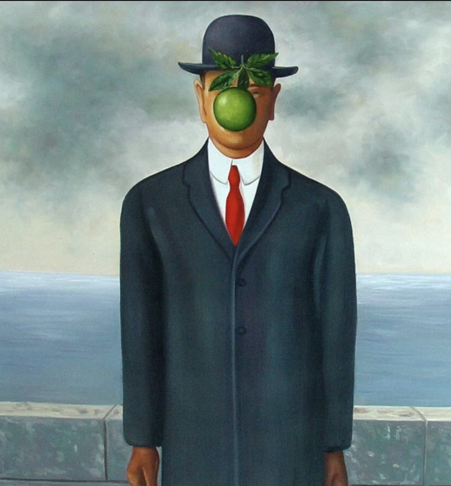
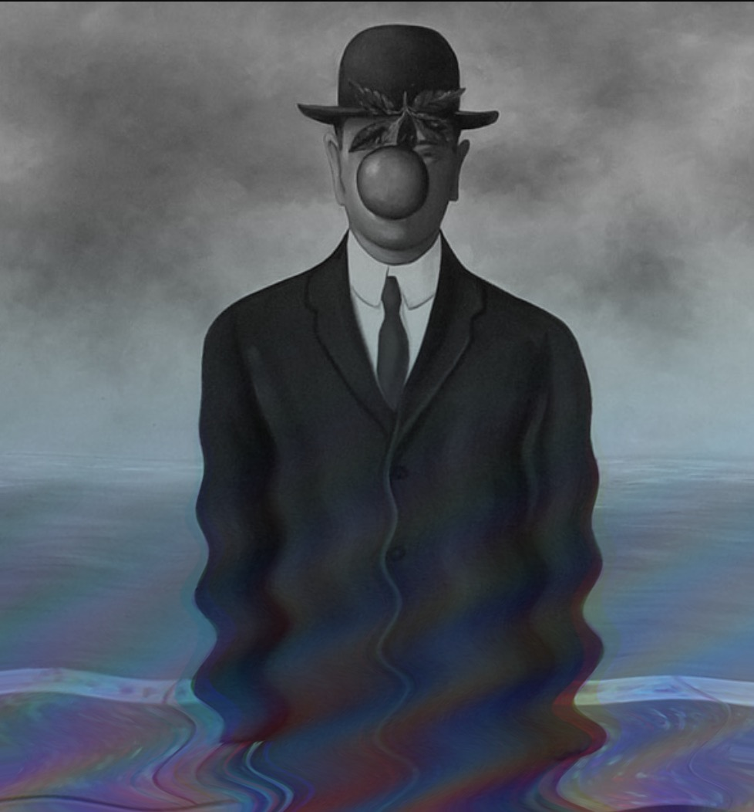
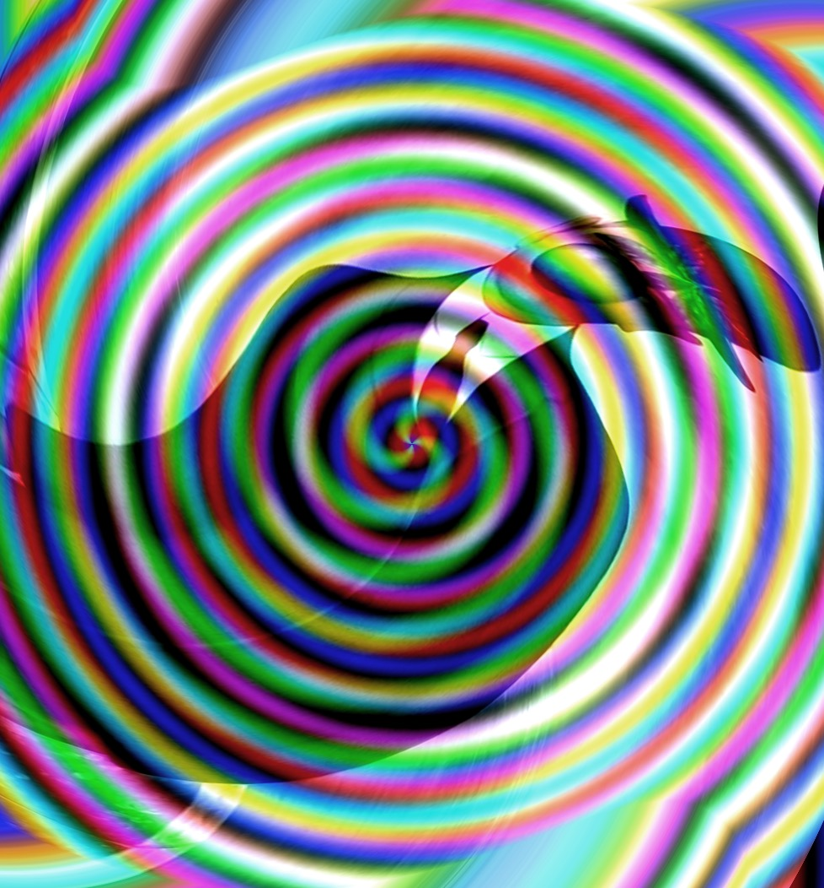
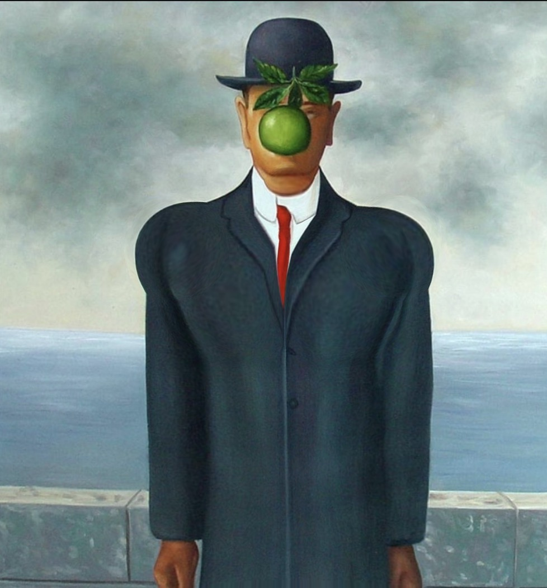
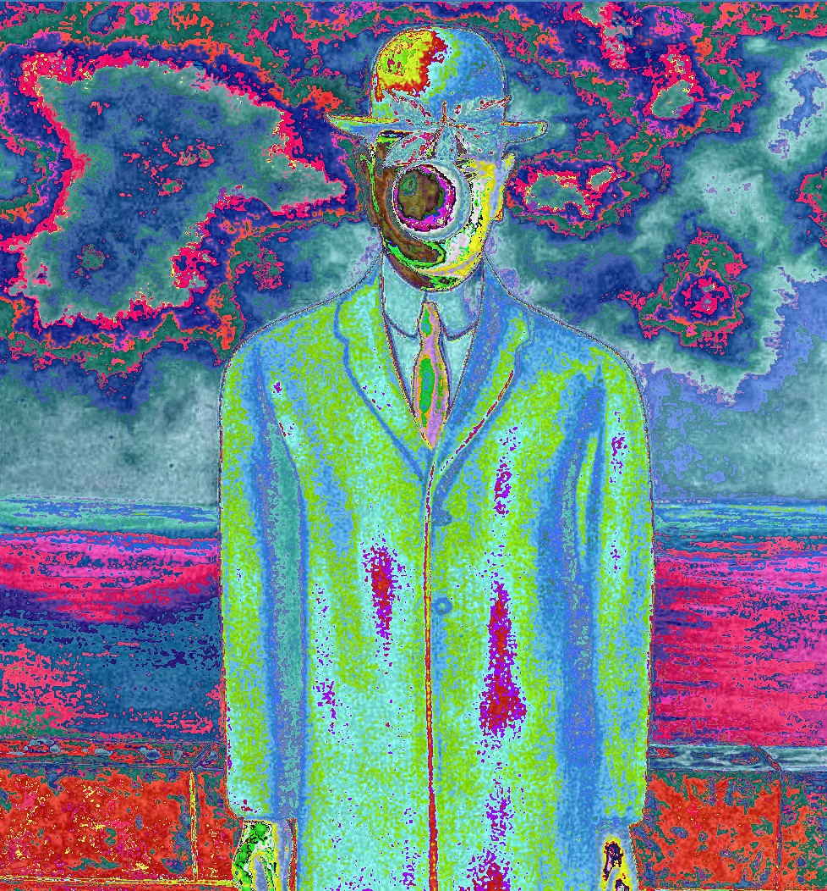
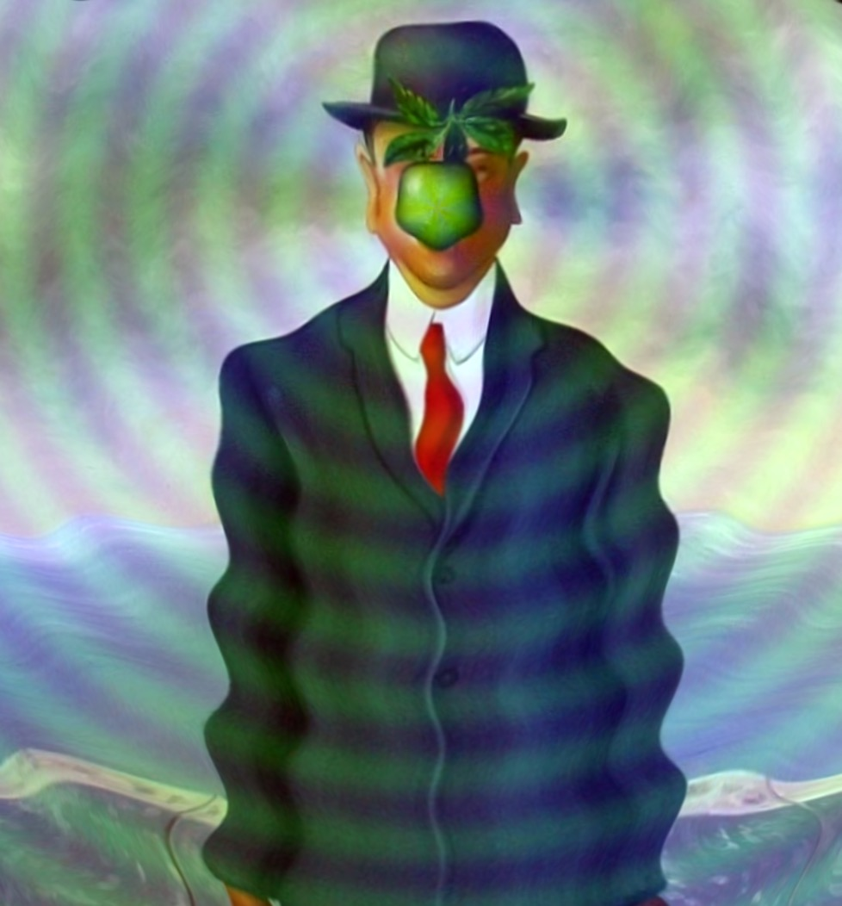

# magritte

`magritte` is a C++20 command-line JPEG processor. It applies processor
commands from left to right to transform a source image or generate an image
from a blank canvas.

JPEG decoding and encoding currently use the macOS ImageIO framework.

## Build

```sh
cmake -S . -B build
cmake --build build
```

## Recommended workflow: create a formula file

The recommended way to create an image is to describe it in a `.yml` formula
file. This keeps the complete recipe readable, repeatable, and easy to adjust.

Create a file such as `my-image.yml`:

```yaml
canvas:
  file_name: "my-image.jpg"
  width: 480
  height: 320
processors:
  - name: warm gradient
    command: "rgb = (35 + 190 * X / W, 45 + 150 * Y / H, 170)"
  - name: increase contrast
    command: "contrast 1.15"
```

Then run it:

```sh
./build/magritte -f my-image.yml
```

To transform an existing JPEG, create a formula without the `canvas` section
and provide a source:

```sh
./build/magritte --source photo.jpg -f photo-edit.yml -o edited.jpg
```

See [`formulas/`](formulas) for runnable examples, including generated
canvases, formulas that transform source images, and formulas that compose
other formulas.

## Examples

The examples below transform the shared
[`original.jpeg`](formulas/examples/original.jpeg) source image. Select an
example to view its formula.

| Original | Bottom wave color |                                          Hitchcock                                          |
| :---: | :---: |:-------------------------------------------------------------------------------------------:|
|  | [](formulas/bottom-wave-color.yml) |           [](formulas/hitchcock.yml)           |
| Source image | [`bottom-wave-color.yml`](formulas/bottom-wave-color.yml) |                          [`hitchcock.yml`](formulas/hitchcock.yml)                          |
| **Mass gain** | **Recursive chroma** |                                      **Starling lens**                                      |
| [](formulas/mass-gain.yml) | [](formulas/recursive-chroma.yml) | [](formulas/starling-lens.yml) |
| [`mass-gain.yml`](formulas/mass-gain.yml) | [`recursive-chroma.yml`](formulas/recursive-chroma.yml) |                      [`starling-lens.yml`](formulas/starling-lens.yml)                      |

## Documentation

- [Usage guide](USAGE.md) — formula files, source images, output options,
  command ordering, and debug mode.
- [Processor reference](PROCESSORS.md) — every processor and the expression
  language used by formula processors.

## Tests

```sh
ctest --test-dir build --output-on-failure
```
