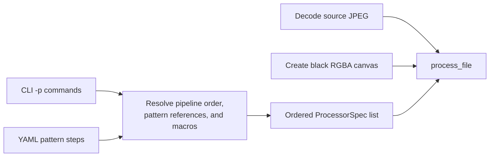
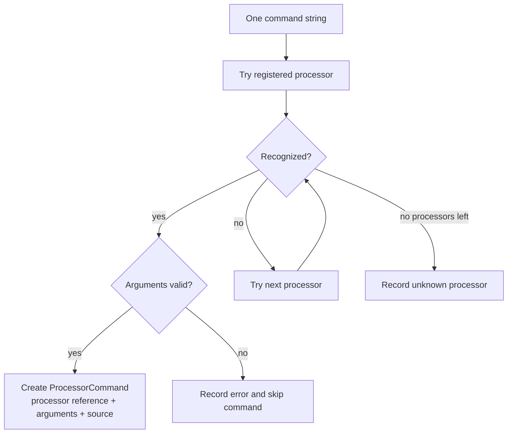
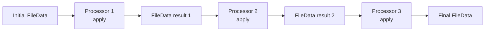

# Processor selection and image flow

This document explains how Magritte selects processors for command strings and
passes `FileData` from one processor to the next.

The main implementation points are
[`parser.cpp`](parser.cpp),
[`processor.cpp`](processor.cpp), and
[`ImageProcessor`](../include/magritte/processors/image_processor.h).

## Preparing a pipeline

The CLI accepts processor commands directly with `-p` and indirectly through
YAML pattern files. Before image processing starts,
[`process_pipeline()`](pipeline.cpp) resolves pattern references, preserves the
declared command order, combines macros, and chooses the initial image:

- With `--source`, the initial `FileData` is decoded from the input JPEG.
- Without `--source`, a pattern-provided canvas becomes a black, opaque
  `FileData` buffer.

Both paths eventually produce an ordered `std::vector<ProcessorSpec>`. A
`ProcessorSpec` contains the original command and an optional descriptive name.



## How a processor is selected

`parse_processors()` sends each command string to
`parse_processor_command()`. That function trims the command and visits the
processor registry in order.

For each registered `ImageProcessor`:

1. `parse_arguments(command)` checks whether the syntax belongs to that
   processor.
2. A non-match returns `std::nullopt`, so registry scanning continues.
3. A match returns validated argument strings.
4. A matching but malformed command throws `std::invalid_argument`. The error
   is captured for reporting, and that command is not applied.



Registry order matters when syntaxes overlap. The registry in
[`parser.cpp`](parser.cpp) currently contains:

1. Rotate, mirror, blur.
2. Black-and-white, contrast, fisheye, twist, spin.
3. Flow lines and lighting.
4. RGB, local RGB, local warp, and saturation formulas.
5. Loop RGB, loop warp, and warp formula.

Keyword processors usually recognize commands such as `blur 3`.
`AssignmentProcessor` provides recognition for fixed assignments such as
`warp = (...)`. The RGB formula processor has custom recognition because its
left-hand side can be any ordered, non-repeating subset of `r`, `g`, and `b`.

The result of selection is a `ProcessorCommand`. It retains a reference to the
stateless processor singleton, its validated argument vector, and the original
source command.

Invalid commands are reported and skipped; they do not prevent other valid
commands in the same pipeline from running.

## Sequential data flow

`process_file()` owns the current `FileData` and executes the selected commands
strictly from left to right:

```cpp
data = command.processor.get().apply(
    std::move(data),
    command.arguments,
    macros
);
```

Each result becomes the next processor’s input:



This is why command order is observable. For example, `mirror x` followed by
`blur 3` blurs the mirrored pixels, while reversing the commands mirrors the
already blurred result.

The global macro map is passed to every processor. Processors that do not use
formulas ignore it; formula-aware processors resolve their expression macros
when `apply()` begins.

Loop processors preserve the same flow at a smaller scale. They wrap another
processor and repeatedly move each iteration’s result into the next
iteration.

## Why `apply()` takes `FileData` by value

The interface is:

```cpp
virtual FileData apply(
    FileData data,
    const std::vector<std::string> &arguments,
    const MacroMap *macros
) const;
```

Although the parameter is by value, `process_file()` passes it with
`std::move`. The processor therefore receives ownership of the current image
buffer without requiring a deep copy. It can choose the algorithm that fits
its transformation:

- Mutate the owned pixel vector and return it.
- Keep the owned buffer as an immutable source, allocate a destination buffer,
  and return the destination.
- Make a source snapshot while updating the owned buffer.

That choice is internal to the processor. The pipeline always sees the same
contract: one `FileData` enters and one valid `FileData` leaves.

## In-place and out-of-place processors

“In-place” here means that the processor mutates the pixel vector it received
by value. The caller has already moved ownership to it, so this does not mutate
an image still owned elsewhere.

| Strategy | Processors | Reason |
| --- | --- | --- |
| In-place | Mirror, black-and-white, contrast, RGB formula, saturation formula, flow lines | Each output can be written safely without needing an untouched full-image source during those writes. |
| New destination buffer | Rotate, blur, fisheye, twist, spin, local RGB, warp, local warp | Output positions depend on a different layout or on source pixels that must remain unchanged until all output pixels are computed. |
| In-place with a source snapshot | Lighting | Lighting writes into the owned image but retains a copy for stable luminance and occlusion calculations. |
| Delegated | Loop RGB and loop warp | The wrapped processor decides; each returned result feeds the next iteration. |

Some details are worth noting:

- Rotate allocates a buffer with swapped dimensions for every quarter turn.
- Blur starts with a copy so neighborhood reads always observe the unblurred
  image.
- Fisheye, twist, spin, and warp compute a source coordinate for each
  destination pixel and write the sampled color into a separate result.
- Local formulas sample the immutable input, so they cannot safely overwrite
  that same buffer while traversing it.
- Flow lines compute their coverage before compositing it into the owned
  buffer, allowing the final blend to happen in-place.

An implementation may change strategy later without changing the
`ImageProcessor` interface.

## Debug hints and invariants

When debug mode is enabled, `process_file()` calls `add_debug_hints()` after
the main transformation. Most processors inherit the default implementation,
which returns the image unchanged. Processors with a visualization overlay may
modify the already transformed result.

After every processor and optional debug overlay,
`validate_file_data()` verifies:

- Width and height are nonzero.
- `width * height` does not overflow.
- The pixel vector contains exactly `width * height` entries.

This check catches a processor that returns inconsistent dimensions or storage
before its result reaches the next command.

## End of the pipeline

After the last processor:

- A source-based run sends the final `FileData` to `save_file()`.
- A generated-canvas run does the same through `process_created_image()`.
- Valid and invalid processor summaries are printed.

Output overwrite checks happen before decoding or processing. The file is only
encoded after all selected processors finish successfully.
