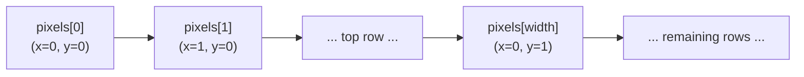
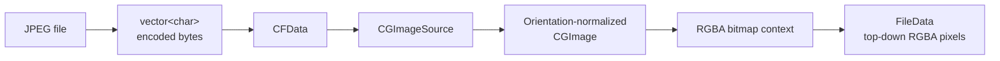
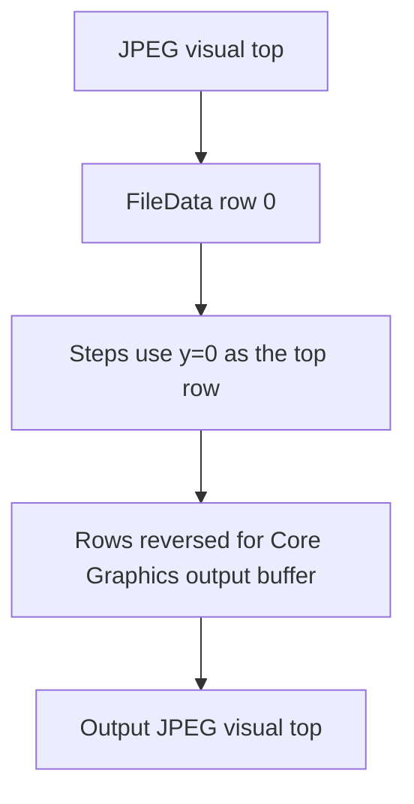
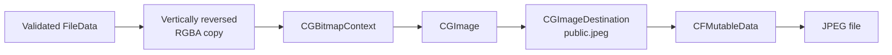

# JPEG input, `FileData`, and output

Magritte uses JPEG for files on disk and a simple RGBA raster for processing in
memory. The conversion code is implemented in
[`file.cpp`](file.cpp), with path and JPEG boundary checks in
[`input_validation.cpp`](input_validation.cpp).

## The in-memory format

[`FileData`](../../include/magritte/common/file_data.h) contains:

```cpp
struct Pixel {
    std::uint8_t red;
    std::uint8_t green;
    std::uint8_t blue;
    std::uint8_t alpha;
};

struct FileData {
    std::size_t width;
    std::size_t height;
    std::vector<Pixel> pixels;
};
```

Each `Pixel` is exactly four bytes in RGBA order. Pixels are tightly packed in
row-major order, with the top row first:



The index for coordinate `(x, y)` is:

```text
y * width + x
```

A valid image has nonzero dimensions, a non-overflowing `width * height`, and
exactly that many pixels. `validate_file_data()` enforces this invariant after
every step and before encoding.

JPEG does not contain an alpha channel. Decoded JPEG pixels are effectively
opaque, but alpha remains part of `FileData` so steps and tests have a
uniform RGBA representation. Encoding to JPEG cannot preserve transparency.

## Input validation

Before decoding a source image, `validate_input()`:

1. Converts input and output paths to normalized absolute paths.
2. Rejects using the same path for input and output.
3. Requires the input to exist and be a regular file.
4. Checks for the JPEG start marker `FF D8` and end marker `FF D9`.

The marker check is a quick format guard, not a complete JPEG validation.
ImageIO performs the authoritative decode and reports malformed image data.

## Decoding JPEG into `FileData`

`read_file()` reads all encoded bytes and passes them to `decode_jpeg()`, which
uses Apple Core Foundation, Core Graphics, and ImageIO:



The conversion steps are:

1. `read_encoded_file()` opens the file in binary mode, determines its size,
   allocates a byte vector, and reads the complete file.
2. `CFDataCreate()` exposes those bytes to ImageIO.
3. `CGImageSourceCreateWithData()` creates an image source, and
   `CGImageSourceCreateImageAtIndex()` verifies that the first image can be
   decoded.
4. `CGImageSourceCreateThumbnailAtIndex()` creates a full-size image with
   `kCGImageSourceCreateThumbnailWithTransform`. Despite the API name
   “thumbnail,” its maximum size is the source image’s largest dimension, so
   this step preserves full size while applying JPEG orientation metadata.
5. A `FileData` pixel vector is allocated from the normalized width and height.
6. A Device RGB bitmap context is created directly over that vector with
   8-bit components, four bytes per pixel, premultiplied alpha last, and
   big-endian 32-bit byte order. This layout matches the RGBA `Pixel` struct.
7. The Core Graphics coordinate transform translates and flips the drawing
   vertically so the resulting vector uses Magritte’s top-row-first
   convention.
8. `CGContextDrawImage()` converts the decoded image into the RGBA buffer.

The decoder rejects empty or overflowing dimensions before allocating
`width * height` pixels.

## Orientation and row order

Core Graphics drawing coordinates and Magritte’s vector row order use opposite
vertical conventions. The decoder accounts for this while drawing, and the
encoder accounts for it before creating the output image.



Orientation metadata is applied during decode. Steps therefore operate on
the visually oriented pixels rather than needing to interpret EXIF orientation
themselves.

## Encoding `FileData` as JPEG

`save_file()` performs the reverse conversion:



The steps are:

1. Validate the dimensions and pixel count.
2. Create missing parent directories for the destination.
3. Copy rows into a temporary pixel vector in reverse vertical order for Core
   Graphics.
4. Create a Device RGB bitmap context over the temporary RGBA vector.
5. Create a `CGImage` from that context.
6. Create an ImageIO destination with type `public.jpeg` and one output image.
7. Add the image and finalize the destination into a mutable `CFData` buffer.
8. Open the output path in binary truncate mode and write the encoded bytes.

No explicit JPEG quality dictionary is supplied, so ImageIO uses its default
encoding properties.

The overwrite decision is made by the processing workflow before
`save_file()` is called. Once called, `save_file()` opens the destination with
truncation.

## Resource ownership and failures

Core Foundation and Core Graphics objects require explicit release functions.
`file.cpp` wraps them in a `ScopedPointer` alias based on
`std::unique_ptr`, pairing each object with `CFRelease`, `CGImageRelease`,
`CGContextRelease`, or the appropriate color-space release function. This
keeps every early error path from leaking native resources.

I/O and conversion failures throw `std::runtime_error` with context for the
failed stage, including file opening, byte reading, decoder creation,
orientation normalization, buffer creation, JPEG finalization, and output
writing.
