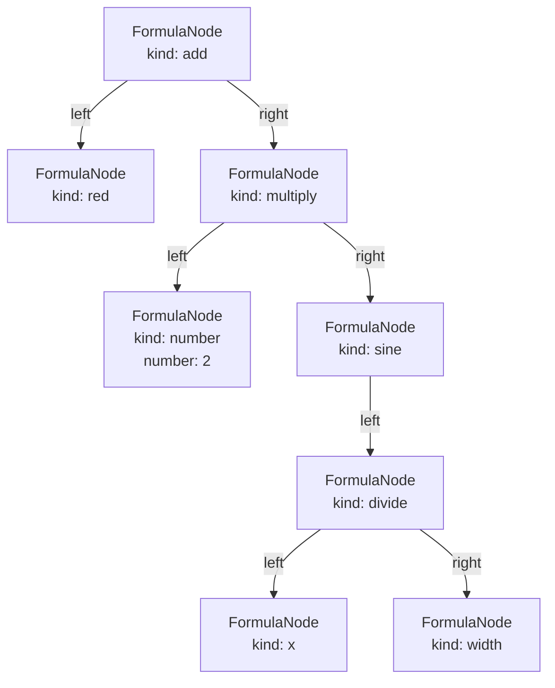
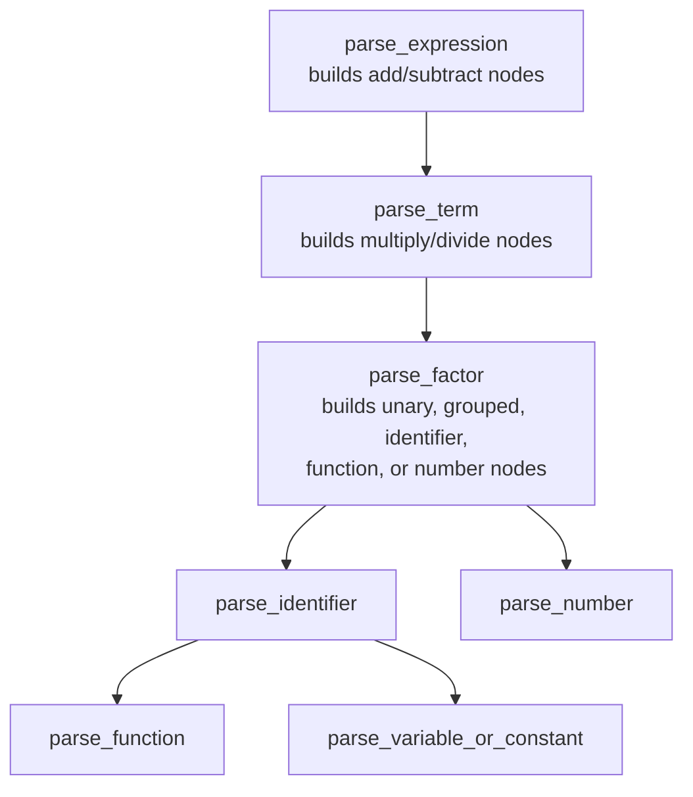
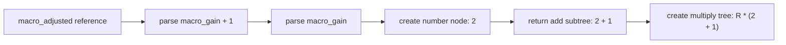

# Creating `Formula` trees

This document explains only how the mathematical expression parser turns text
into a `Formula`: an owned tree of `FormulaNode` objects. Step selection
and image evaluation happen elsewhere.

The implementation is in
[`formula_parse.cpp`](formula_parse.cpp), and the resulting types are declared
in
[`formula_parse.h`](../../../../include/magritte/steps/utils/formula_parse.h).

## The tree types

`Formula` is an owning pointer to the root node:

```cpp
using Formula = std::unique_ptr<FormulaNode>;
```

Every `FormulaNode` contains:

- A `FormulaNodeKind` describing what the node means.
- A `number` value, used by numeric literals and constants.
- Up to three owned child nodes: `left`, `right`, and `third`.

The same shape represents leaves, operators, and functions:

| Node category | Stored data | Children |
| --- | --- | --- |
| Number | `kind = number`, numeric value in `number` | none |
| Variable | variable-specific `kind` | none |
| Unary operator/function | operation-specific `kind` | `left` |
| Binary operator/function | operation-specific `kind` | `left`, `right` |
| Three-argument function | operation-specific `kind` | `left`, `right`, `third` |

`std::unique_ptr` gives every node exactly one owner. Moving a child pointer
into its parent assembles the tree, and destroying the root recursively
destroys the complete expression.

## A tree example

For this expression:

```text
R + 2 * sin(X / W)
```

the parser creates:



The root is `add`. Multiplication appears below it because `*` has higher
precedence than `+`. The `sin` node owns the division subtree as its single
argument.

## Parser structure

`FormulaParser` reads directly from a `std::string_view`. It does not create a
separate token list. The `position_` member identifies the next character to
consume, while `skip_whitespace()` permits whitespace between syntax elements.

The grammar is approximately:

```text
expression  := term (("+" | "-") term)*
term        := factor (("*" | "/") factor)*
factor      := ("+" | "-") factor
             | "(" expression ")"
             | identifier
             | function-call
             | number

function-call := identifier "(" [expression ("," expression)*] ")"
identifier    := letter (letter | digit | "_")*
number        := digits with at most one decimal point
```

The parser methods mirror those grammar levels:



`parse_expression()` and `parse_term()` keep a completed left subtree and wrap
it with each following operator. This makes binary arithmetic left-associative:
`R - G - B` becomes `(R - G) - B`.

`parse_factor()` handles unary signs recursively. Unary `+` returns the child
unchanged; unary `-` creates a `negate` node whose `left` pointer owns the
following factor.

Parentheses affect the tree by recursively parsing a complete expression and
returning its root. They do not create a dedicated grouping node.

## Numbers

`parse_number()` scans digits and at most one decimal point, then uses
`std::strtod` to obtain a finite `double`. It creates a `number` node and stores
the parsed value in `FormulaNode::number`.

Numeric exponent notation such as `1e-3` is not part of the current scanner.
Powers are represented with the `pow(base, exponent)` function rather than a
`^` operator.

## Identifiers and constants

An identifier must start with a letter and may continue with letters, digits,
or underscores. `parse_identifier()` converts its text to lowercase before
deciding what to create, so expression identifiers are case-insensitive.

If the identifier is followed by `(`, it is parsed as a function. Otherwise,
`parse_variable_or_constant()` creates a leaf node:

- `PI` and `E` become `number` nodes containing the standard constant.
- `X`, `Y`, `W`, `H`, `U`, `V`, `D`, and `A` become their corresponding
  coordinate node kinds.
- In the normal dialect, `R`, `G`, and `B` become color-variable nodes.
- In the saturation dialect, `S` becomes a saturation node and the RGB
  variables are unavailable.
- Names beginning with `macro_` are expanded through `parse_macro()`.

The parser constructor selects the dialect with
`allow_saturation_variables_` and `allow_other_cell_references_`. These flags
control which leaf and function nodes may be created; they do not change the
arithmetic grammar.

## Functions

The `functions` table maps every function name to:

- Its `FormulaNodeKind`.
- Its required number of arguments.

`parse_function()` finds the definition, parses comma-separated argument
expressions, verifies the argument count, and creates one node. Its argument
trees are moved into `left`, `right`, and `third` in order.

For example:

```text
clamp(R * 2, 0, 255)
```

creates a `clamp` node whose children are:

1. `left`: the `R * 2` subtree.
2. `right`: the number node `0`.
3. `third`: the number node `255`.

The local functions `red(dx, dy)`, `green(dx, dy)`, and `blue(dx, dy)` are in
the same function table as the ordinary math functions. Their nodes can only
be created when `allow_other_cell_references_` is enabled. In other dialects,
the parser rejects them before constructing the node.

## Macros

Macros do not survive as a distinct node kind. When the parser encounters a
`macro_` identifier, `parse_macro()` looks up its expression and runs another
`FormulaParser` over that definition. The resulting subtree is returned in
place of the macro reference.

Given:

```yaml
macro_gain: "2"
macro_adjusted: "macro_gain + 1"
```

the expression:

```text
R * macro_adjusted
```

is assembled like this:



Nested parsers share `macros_currently_unpacking_`, a stack of macro names. A
macro already present in that stack is a cycle and parsing fails instead of
recursing forever.

During syntax-only validation, no macro map is available. A correctly prefixed
`macro_` name temporarily produces a number placeholder so the surrounding
tree can be checked. The later macro-aware parse replaces that placeholder
with the real expansion and rejects unknown or cyclic definitions.

## Containers of formula trees

The public parsing functions may create several `Formula` roots and place them
in a step-specific container:

- `RgbFormula` owns a vector of expression trees paired with target channels.
- `WarpFormula` owns `source_x` and `source_y` trees.
- `VectorFormula` owns horizontal and vertical trees.
- A saturation formula is one `Formula` root.

Tuple punctuation and tuple length are handled while building these
containers. They are not represented as nodes inside an individual formula
tree.

## Parse completion and errors

Successful parsing requires the requested tree or trees to be complete and the
input position to reach the end of the string. This prevents a valid prefix
from hiding unexpected trailing text.

Failures throw `std::invalid_argument` with a one-based character position.
Typical construction failures include an unknown identifier, unknown
function, wrong function arity, missing operand, missing parenthesis, malformed
number, invalid tuple shape, unavailable local function, or macro cycle.

